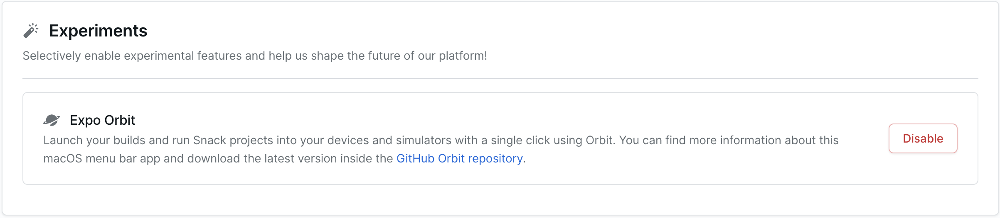

  
  <h1 align="center">Expo Orbit</h1>

Launch builds and start simulators from your menu bar

Orbit is currently in the experimental phase and, as of now, it is only compatible with macOS. We have exciting plans to integrate Orbit further into the Expo ecosystem and add even more features, such as connecting your Expo account to display recent builds and allowing you to launch them directly from the Menu Bar.

Try out Expo Orbit now, explore its capabilities, and share your feedback. Your input will shape the future of this tool and guide us on where to take it next.

## Install

1. Go to [orbit/releases](https://github.com/expo/eas-menu-bar/releases?q=expo-menu-bar) and download the latest release.

2. Unzip the file and drag Expo Orbit to the Applications folder.

3. You're all set! If you want Orbit to automatically start when you log in, click on the Orbit icon in the menu bar, then "Settings" and select the "Launch on Login" option.

### Enabling Orbit buttons on EAS and Snack

To get the most out of Orbit make sure to enable the Expo Orbit experiment inside of your Expo user [settings](https://expo.dev/settings). Navigate to the settings page and turn on the "Expo Orbit" experiment under the Experiments section

   

## 👏 Contributing

If you like Expo Orbit and want to help make it better then check out our [contributing guide](./CONTRIBUTING.md)!

## License

The Expo source code is made available under the [MIT license](LICENSE). Some of the dependencies are licensed differently, with the BSD license, for example.
